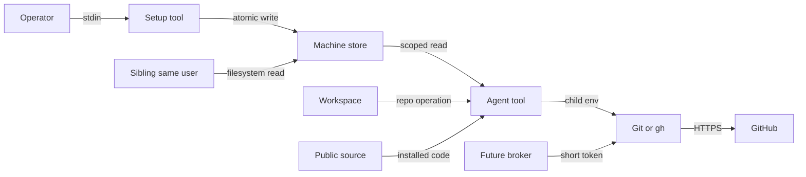

# GitHub machine credential threat model

## Executive summary

GitHub認証の最大リスクは、同じOS userで任意shellとfilesystem readを実行できるAgentがmachine credentialを
直接取得し、tokenが許すrepositoryへ横展開することである。`0600`、既知でないpath、managed hookはこの攻撃者に
対する秘密境界ではない。本設計は同じOS userの全processを一つのtrust domainとして明示的に受け入れる暫定
fine-grained PAT方式であり、GitHub側のresource owner、selected repositories、最小permission、expirationと、
localのrepository / operation allowlistでblast radiusを抑える。trust domainを分ける必要が生じた時点で、別OS user
またはprivate keyもAgentへ渡さないGitHub App credential brokerへ移行する。

## Scope and assumptions

- 対象: `tools/lib/github-auth.sh`、`tools/setup-github-auth.sh`、`tools/task.sh`、
  `tools/backup-to-github.sh`、`tools/report-upstream-issue.sh`、managed hook、validator、GitHub関連eval。
- runtimeはlocal CLI Toolであり、machine store、process environment、Git/`gh` child process、GitHub HTTPSが主境界である。
- 公開source、保存先、file format、Tool仕様は攻撃者に既知とする。security by obscurityはcontrolに数えない。
- 同じOS userで任意shell/filesystem readが可能なAgentから、file内PATを秘密に保つことはできない。
- 実token発行、machineへの導入、organization policy変更、OS user分離、broker運用は本repository変更の範囲外である。
- risk rankingを変えるopen questionはない。untrusted Agentを同じOS userで動かす運用へ変える場合、本PAT方式は不適合になる。

## System model

### Primary components

- Operator setup: stdinまたは既存`gh` credentialからfine-grained PATを一度だけ導入する。
- Machine store: OS account database由来home配下のversioned file。PAT、resource owner、repository、operationを保持する。
- Resolver: storeのpath、owner、mode、link、formatとallowlistを検査し、通常local taskでは他sourceへfallbackしない。
- Canonical consumers: backup、upstream Issue、setup doctor。必要なoperationを明示してresolverを呼ぶ。
- Git/`gh` child: tokenを必要なchild environmentにだけ受け取り、GitHub HTTPSへ接続する。
- Boundary control: tracked secret、guarded変更、push refを検査するが、同じOS userからのfile readをsandboxしない。

### Data flows and trust boundaries

- Operator → terminal secret input: PAT、stdin/TTY。非表示入力、argv不使用、追加行拒否。shell history/clipboardは使用しない。
- terminal → setup Tool stdin: PAT、pipe/TTY。`set +x`、strict fine-grained token shape、値を出力しない。
- setup Tool → machine credential store: PATとlocal allowlist、atomic rename。owner、0700/0600、no symlink、nlink=1、install lock。
- machine store → Agent Tool process: file read。前後inode/device確認、strict five-line parse。これは同一user内の秘密境界ではない。
- Agent Tool → child Git/`gh`: PAT、environment。対象childだけに渡し、Git hook、ambient credential helper/config、redirectを無効化する。
- local Git → GitHub HTTPS: Git objects/ref、TLS。exact `https://github.com/<owner>/<repo>`、query/userinfo/fragment拒否。
- public source → installed Tool: shell code。公開・改変可能。trusted revisionの選択はOperator責務で、hook snapshotはcommit境界だけを守る。
- Workspace → shared machine credential: repository / operation request。同じOS userの全Workspaceは同一trust domain。
- machine → GitHub organization: PAT capability。GitHub側resource owner、selected repositories、permissions、expiration、approval policyが最終blast-radius境界。
- GitHub App private key → broker → installation token: 現在は未導入。将来brokerが別OS identityに隔離される場合だけ新しい秘密境界になる。

#### Diagram

## Assets and security objectives

| Asset | Why it matters | Security objective (C/I/A) |
|---|---|---|
| fine-grained PAT | private contentsとwrite操作へ到達する | C/I |
| GitHub App private key（将来） | installation tokenを生成できる長期secret | C/I |
| installation token（将来） | 1時間のrepository capability | C/I/A |
| private repository contents | 未公開情報・知財 | C/I/A |
| public/backup repository integrity | 配布物・復旧copyの信頼性 | I/A |
| organization内の他repository | 横展開の影響先 | C/I/A |
| commit、branch、tag、PR | review・release・履歴の正当性 | I/A |
| machine credential store | machine-wide capabilityとallowlist | C/I/A |
| audit logとfailure reason | 漏えいなしで原因を識別する証拠 | C/I/A |
| Toolとmanaged hook | credential利用・commit boundaryの実装 | I/A |

## Attacker model

### Capabilities

- 公開repository、保存path、Tool仕様を読み、悪意あるprompt/untrusted repository contentをAgentへ渡せる。
- Workspace内Tool、Git config、hook、remoteを改変し、Agentにshell、filesystem read、network requestを実行させ得る。
- 同じOS userの別processとしてtoken file pathを知り、read、race、symlink、hardlink、permission driftを試み得る。
- process environment、debug trace、temporary file、core dump、log、clipboardからsecretを狙う。
- PATが許す別repository、branch、Issue、PRへ横展開を試みる。

### Non-capabilities

- GitHubのTLS、fine-grained PAT authorization、repository ruleを破る能力は仮定しない。
- 別OS userまたはroot権限は仮定しない。ただし現在は同じOS userだけでPATを読めるため、これでriskは十分高い。
- machine store未導入のmachineからsecretを生成する能力は仮定しない。

## Entry points and attack surfaces

| Surface | How reached | Trust boundary | Notes | Evidence |
|---|---|---|---|---|
| PAT stdin | `--install-token` | Operator → setup | argv、複数行、classic PATを拒否 | `tools/setup-github-auth.sh` / `install_token` |
| saved `gh` migration | `--install-from-gh` | Operator setup → store | 初期setup専用。通常taskから呼ばない | `tools/setup-github-auth.sh` / `install_from_gh` |
| machine file | canonical path | store → Tool | owner/mode/link/format/inode検査 | `tools/lib/github-auth.sh` / `github_auth_read_machine_file` |
| CI environment | explicit CI flags | CI secret → Tool | exact repository/operationだけ | `github_auth_ci_resolve` |
| Git remote | backup/materialization | Workspace → GitHub | exact host、credential-free URL | `github_auth_repository_from_url` |
| child Git | backup push/read | Tool → Git | hook/helper/config/redirectを隔離 | `github_git_run` |
| Issue API | upstream report | Tool → `gh` | fixed upstream allowlist + local operation allowlist | `tools/report-upstream-issue.sh` |
| task context | ordinary work | task → readiness | network前にmachine store readinessを検査 | `tools/task.sh` / `require_backup_machine_ready` |

## Top abuse paths

1. 同一OS userの悪意あるAgentが既知pathを直接readし、PATでselected repositoryを改変する。0600では防げず、scope/expiry/revocationだけが影響を限定する。
2. 悪意あるWorkspaceがGit hookを置き、tokenを持つ`git push`からenvironmentを盗む。child Gitでhookを無効化して遮断する。
3. 一体だけの`GH_TOKEN`をresolverへ注入しmachine-readyを偽装する。通常local fallbackを禁止し、明示CIだけを例外にする。
4. symlink/hardlink/raceでsetupのwrite/read先を差し替える。path/link/owner検査、same-directory temp、lock、atomic rename、read前後identityで低減する。
5. remote URL、Git `insteadOf`、credential helper、redirectを使い別hostへcredentialを誘導する。exact URL、ambient config/helper排除、redirect/protocol制限で拒否する。
6. 公開forkの改変Toolをtrusted machineで実行しstoreを読む。local allowlistは誤操作を減らすが、同一userのmalicious codeは防げないためtrusted revisionまたはOS分離が必要。
7. 複数repository権限を持つPATを一つ奪い横展開する。resource owner一つ、selected repositories、最小permission、期限、machine別tokenでblast radiusを限定する。
8. rotation中に並行Agentがpartial fileを読む。atomic replaceでold/newどちらかだけを読み、install lockで同時writerを拒否する。old tokenを既に持つchildは完了または明示errorまで存続し得る。

## Threat model table

| Threat ID | Threat source | Prerequisites | Threat action | Impact | Impacted assets | Existing controls (evidence) | Gaps | Recommended mitigations | Detection ideas | Likelihood | Impact severity | Priority |
|---|---|---|---|---|---|---|---|---|---|---|---|---|
| TM-001 | sibling same-user Agent | 任意filesystem read | PATを直接窃取 | private read、repo改変 | PAT、全許可repo | selected repo/operation、expiry | file secretは防げない | untrusted workload導入前にOS user分離またはbroker | GitHub audit、machine別token名 | high | high | high |
| TM-002 | malicious Workspace hook | token付きGit child | hook/helperでenvironment取得 | PAT漏えい | PAT、repo integrity | hook/helper/config/redirect無効化 | same-user direct readは残る | fixtureを維持、raw authenticated Gitを禁止 | unexpected GitHub API/ref audit | medium | high | low |
| TM-003 | process token保有Agent | machine storeなし | readinessを偽装 | Agent間の認証分岐 | readiness、backup availability | local fallback禁止、explicit CI | Agentはraw `gh`を実行可能 | canonical Tool契約をevalで固定 | source/reason集計 | high | medium | low |
| TM-004 | same-user racer | setup/readと並行write | symlink/hardlink/rename race | secret leak/allowlist改変 | store、PAT | owner/mode/link/lock/atomic rename/identity | same-user attackerはlockも改変可能 | hostile same-userならOS分離 | `auth-store-*` reason監視 | medium | high | medium |
| TM-005 | modified public fork | trusted machineでTool実行 | storeを直接read | PAT漏えい | PAT、repo contents | 明示setup、local allowlist | source integrityだけではsame-user readを防げない | trusted revision確認、untrusted forkは別user/sandbox | origin/revision inventory | medium | high | high |
| TM-006 | stolen PAT holder | PATが複数repo許可 | lateral repository operation | org内横展開 | other repositories | one owner、selected repos、operation metadata | local operation allowlistはraw APIを止めない | GitHub permission最小化、短期限、rotate | tokenごとのaccess review | medium | high | high |
| TM-007 | local observer | token child実行中 | process env/core dump取得 | PAT漏えい | PAT | tokenは必要childだけ、xtrace off | same-user process inspectionは残る | brokerでtoken非公開、core dump制限 | abnormal process/debug audit | medium | high | high |
| TM-008 | network/config attacker | hostile URL/config | tokenを別hostへ送る | PAT漏えい | PAT | exact GitHub URL、helper/config/redirect/protocol制限 | TLS trust store compromiseは範囲外 | controlsをfixture固定 | destination failure reason | low | high | medium |
| TM-009 | concurrent operator/Agent | rotationと処理が並行 | old credentialを一時利用 | transient failure/old access | availability、PAT | atomic replace、writer lock | childが保持したold tokenは即時消去不能 | revoke後にcapability probe、失敗を再分類 | 401とrotation timestamp相関 | medium | medium | medium |
| TM-010 | compromised canonical Tool | same-user write/code execution | allowlistを迂回しraw API | 任意token操作 | 全assets | guarded commit、managed snapshot、validator | `.git`/working treeもsame-userが改変可能 | remote rules、OS isolation/broker | branch protection/audit log | medium | high | high |

## Criticality calibration

- critical: organization-wide secretやprotected default branchを、外部攻撃者が追加条件なく継続制御する。例: org-wide App key公開、force更新可能tokenの公開commit。
- high: same-user Agentまたはmalicious WorkspaceからPAT窃取、private repository read、許可repo write。例: TM-001、TM-005、TM-010。
- medium: race/rotation/redirectに追加条件が必要、または一時availabilityと限定integrityへ影響。例: TM-004、TM-008、TM-009。
- low: secretを含まないdiagnosticの軽微な情報差、容易に再試行できる拒否。例: store未導入reason、remote未設定reason。

## PAT, GitHub App, and broker decision

- fine-grained PAT: 現時点の採用方式。machine別、resource owner一つ、Only select repositories、expiration必須。
  backupだけならContents read/write、Issue/PRは実際に使う場合だけ各read/write、workflow更新時だけWorkflowsを追加する。
  classic PATは禁止する。
- GitHub App: installation tokenは1時間で失効し、repositoryとpermissionをtoken生成時にも絞れる。ただしprivate keyを
  同じOS userが読める設置ではTM-001/TM-005/TM-010が残るため、単独移行は採らない。
- credential broker: destination、repository、branch、operation、expected SHAをserver側で固定でき、Agentへ長期secretを
  渡さない場合に最も強い。別OS identity/service、replay防止、rate limit、audit、key rotation、fail-closedが必要で導入コストが高い。
- 移行条件: untrusted Agent/Workspaceを同じOS userで実行する、PATのselected repositoryが高機密または多数になる、
  unattended writeが増える、organization policyがPATを禁止する、process environment漏えいを許容できない、のいずれか。
  broker障害時にPAT、SSH、Browser loginへfallbackしない。

## Operational requirements and residual risk

- machineごとに別tokenを発行し、token名でmachineを識別する。token値を会話、Knowledge、STATE、log、clipboardへ保存しない。
- organizationのPAT access、approval、maximum lifetime policyを確認する。repository追加時はGitHub側selected repositoriesと
  local allowlistを同時に更新し、`--check`で実capabilityを再確認する。
- rotationは新token導入 → `--machine-ready` → `--check` → old token revoke。紛失machineは先にrevokeし、影響repository一覧を確認する。
- storeをcloud-sync folderへ置かない。Time Machine等のbackup対象なら暗号化・access control・除外方針をOperatorが確認する。
- managed hook snapshotはtracked secretとcommit/push integrityを補強するが、same-user credential theftやraw network requestは防がない。
- repository/operation allowlistはcanonical Toolの事故防止であり、same-user attackerに対するauthorization boundaryではない。

GitHub公式根拠:
[fine-grained PATのresource owner・selected repositories・最小permission](https://docs.github.com/en/authentication/keeping-your-account-and-data-secure/managing-your-personal-access-tokens)、
[organizationのPAT policy・approval・maximum lifetime](https://docs.github.com/en/organizations/managing-programmatic-access-to-your-organization/setting-a-personal-access-token-policy-for-your-organization)、
[GitHub App installation tokenの1時間expiryとrepository/permission縮小](https://docs.github.com/en/rest/apps/apps#post-app-installations-installation-id-access-tokens)。

## Focus paths for security review

| Path | Why it matters | Related Threat IDs |
|---|---|---|
| `tools/lib/github-auth.sh` | secret selection、allowlist、child process境界 | TM-001〜TM-009 |
| `tools/setup-github-auth.sh` | secret input、atomic store、rotation | TM-004、TM-007、TM-009 |
| `tools/backup-to-github.sh` | immutable SHAのremote write | TM-002、TM-006、TM-010 |
| `tools/report-upstream-issue.sh` | API destination/operation allowlist | TM-006、TM-010 |
| `tools/task.sh` | 作業前machine readiness | TM-003 |
| `tools/check-boundary.sh` | tracked secretとpush検査 | TM-005、TM-010 |
| `tools/install-git-hooks.sh` | managed snapshotの導入範囲 | TM-002、TM-010 |
| `tools/test-github-auth.sh` | deterministic security fixture | TM-002〜TM-009 |
| `tools/validate-agent-directory.sh` | security invariantの構造固定 | TM-003、TM-010 |
| `evals/cases/github-auth-*.yaml` | Agent行動の回帰 | TM-003、TM-005 |

## Quality check

- [x] setup、store read、CI fallback、Git、Issue、task入口をcoverした。
- [x] 依頼で列挙されたtrust boundaryをdata flowまたはthreatへ対応付けた。
- [x] runtime、initial setup、test/eval、remote controlを分離した。
- [x] 同一OS userの根本制約と守れないthreatを明記した。
- [x] 依頼文がdeployment、auth、data sensitivity、multi-Agent前提を確定しているため追加質問は不要と判断した。
